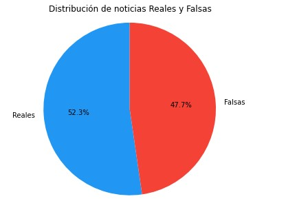
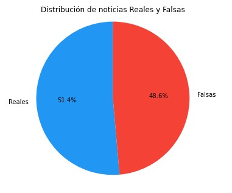
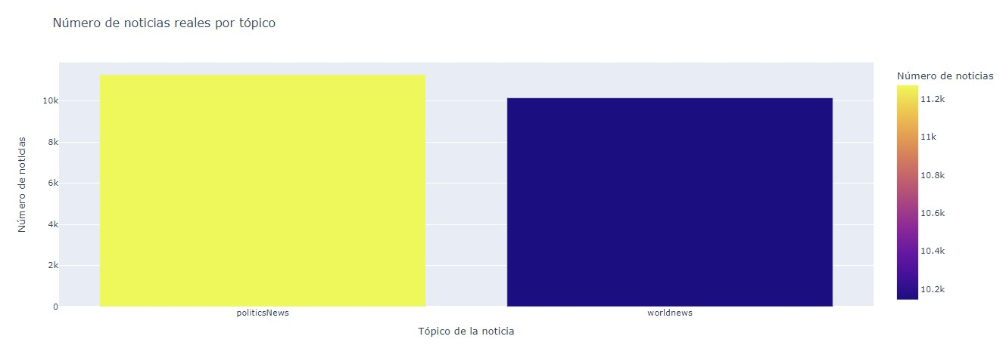
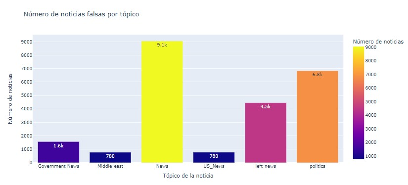

# Reporte de Datos

De acuerdo con el análisis explotario de los datos que comprende los dos archivos: Fake.csv y True.csv. Se identificó:
* Los archivos tienen la misma estructura, descrita en data_dictionary.md de este proyecto.
* Los archivos cuentan con un número similar de registros lo que permite afirmar que para el objetivo de este proyecto los dos grupos de datos se encuentran balanceados.
* La mayoría de los registros y en sus columnas presentan datos. Sin embargo, faltan algunos datos en la fecha en registros del archivo Fake.csv y en muy pocos casos en el campo 'text' como se explica en las secciones siguientes.

## Resumen general de los datos
De acuerdo con el análisis exploratorio de los datos se encuentra para el archivo de **noticias reales - True.csv**:

1. Total de noticias: 21417.
2. Noticias en el año 2016: 4716.
3. Noticias en el año 2017: 16701.
4. Las noticias se encuentran asociadas a dos temas: 'politicsNews' y 'worldnews'.
5. Noticias que tratan de politicsNews : 11272.
6. Noticias que tratan de worldnews: 10145.
7. En el campo 'text' se encontró un registro con 1 caracter. Este registro será parte de la limpieza a realizar en los datos.
8. El campo título contiene información acorde con los esperado.

De acuerdo con el análisis exploratorio de los datos se encuentra para el archivo de **noticias falsas - Fake.csv**:

1. Total de noticias: 23481.
2. El campo 'date' presenta diferentes formatos e incluso datos que no corresponden a la fecha, sin embargo dado el problema que se plantea y como resultado de análisis exploratorio no se considera información relevante para el desarrollo del objetivo del proyecto.
3. Las noticias se encuentran asociadas a dos temas: 'News', 'politics', 'Government News', 'left-news', 'US_News' y 'Middle-east.
4. Noticias que tratan de politics : 6841.
5. Noticias que tratan de News: 9050.
6. Noticias que tratan de Government News: 1570.
7. Noticias que tratan de left-News: 4459.
8. Noticias que tratan de US_News: 783.
9. Noticias que tratan de Middle-east: 778.
10. Se encuentran 630 registros sin contenido en el texto de la noticia, los cuales serán eliminados en el preprocesamiento del archivo.
11. Se encuentran registros 211 registros cuyo tamaño del contenido es muy corto inferior o igual a 50 caracteres. Estos registros serán eliminados de la fuente de datos a procesar. Y se probarán los resultados para evaluar si puede requerirse hacer una nueva inspección y tomar registros con un tamaño del contenido superior al límite usado inicialmente de 50 caracteres.
Los formatos de las variables se explican en el documento data_dictionary.md.
12. El campo título contiene información acorde con los esperado.

## Resumen de calidad de los datos

Los datos se han analizado de manera individual para los dos archivos origen de los datos: True.csv y Fake.csv. Como resultado se tiene en este aspecto de calidad de los datos:
1. No hay datos faltantes en el archivo True.csv que corresponde a las noticias reales.
2. La información de las noticias reales está completa en cuanto al título, contenido y tópico de la noticia, solo 1 registro no presenta la información en el campo 'text'. La fecha aunque está completa para todos los registros no es relevante para el propósito de este proyecto.
3. El archivo Fake.csv presenta datos faltantes en la fecha de algunos de los registros (Se presentan registros (52) con errores), aunque presenta información no corresponde a una fecha. Y tal como se mencionó previamente no se dedicarán recursos y esfuerzos en corregir la situación de esta variable particular dado que no se considera relevante para el propósito de este proyecto.
4. La información de las noticias falsas está completa en cuanto al título, contenido y tópico de la noticia para la mayoría de los registros, sin embargo 630 de ellos no presentan datos en el campo 'text' y 211 presentan un tamaño en el contenido inferior o igual a los 50 caracteres. Estos se eliminarán como parte del proceso de preprocesamiento de los datos y como ya se mencionó la inspección continuará para determinar si este límite de los 50 caracteres es un tamaño razonable para el entrenamiento del modelo o deberá aumentarse.
5. La distribución de las noticias reales y falsas antes del procesamiento es: 52.3% y 47.7%.
6. La distribución de las noticias reales y falsas después del procesamiento es: 51.4% y 48.6%.
7. Con esta distribución de las noticias reales y falsas los datos se encuentran razonablemente balanceados.

**Distribución de la noticias antes del procesamiento**

**Distribución de la noticias después del procesamiento**

## Variable objetivo

La variable objetivo corresponde al tipo de noticia y se crea al generar un solo conjunto de datos con las noticias falsas y reales, de tipo entero y asignando 1 a las noticias reales y 0  a las noticias falsas.

## Variables individuales

Las características del conjunto de datos corresponden a las variables: title (título de la noticia), text (contenido de la noticia) y subject (tópico asociado a la noticia). Sin embargo, dado que el tópico en los datasets de las noticias reales y falsas nos son los mismos y puede generar bias en el modelo se decide solo considerar las variable: title y text para el entrenamiento del modelo.

**Variable subject (tópico)**:
La siguiente gráfica muestra la distribición de noticias por cada tópico para las _noticias reales_:

En la cual se observan 11272 noticias del tópico _politicsNews_ y 10145 noticias que tratan del tópico _worldnews_

La siguiente gráfica muestra la distribición de noticias por cada tópico para las _noticias falsas_:

En la cual se observan 6841 noticias del tópico _politics_, 9050 del tópico _News_, 1570 del tópico _Government News_, 4459 del tópico _left-News_, 783  del tópico _US_News_ y 778 del tópico _Middle-east_.

**Variable título**
El título de cada noticia es un breve resumen de lo que trata cada una de ellas, analizando esta variable encontramos:

En el archivo True.csv
* Tamaño Máximo del título: 133 caracteres. 
* Tamaño mínimo del título: 26 caracteres.
* Tamaño promedio del título: 65 caracteres.
* Todos los registros tiene título.

En el archivo Fake.csv
* Tamaño Máximo del título: 279 caracteres. 
* Tamaño Mínimo del título: 8 caracteres.
* Tamaño promedio del título: 94 caracteres.
* Todos los registros tiene título.

Transformaciones a realizar:
1. Eliminar posibles caracteres vacios al inicio o final del contenido de las variables.
2. Validar la longitud de las variables después de la limpieza de los caracteres vacíos para determinar que existe información válida en cada uno de las variables.
3. Eliminación de registros sin información en la variable.

**Variable texto**
El texto de cada noticia es el contenido de  cada una de ellas, analizando esta variable encontramos:

En el archivo True.csv
* Tamaño Máximo del contenido: 29780 caracteres. 
* Tamaño mínimo del contenido: 151 caracteres.
* Tamaño promedio del contenido: 2382 caracteres.
* Todos los registros presentan contenido.

En el archivo Fake.csv
* Tamaño Máximo del contenido: 51793 caracteres. 
* Tamaño mínimo del contenido: 51 caracteres.
* Tamaño promedio del contenido: 2641 caracteres.

Transformaciones a realizar:
1. Eliminar posibles caracteres vacíos al inicio o final del contenido de las variables.
2. Validar la longitud de las variables después de la limpieza de los caracteres vacíos para determinar que existe información válida en cada uno de las variables.
3. Eliminación de registros sin información en las variables.
