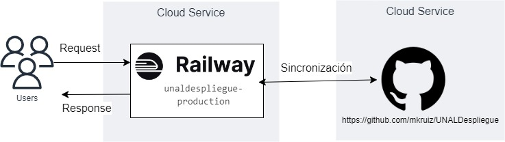

# Despliegue de modelos

## Infraestructura

- **Nombre del modelo:** 

unaldespliegue-production

- **Plataforma de despliegue:** 

Plataforma seleccionada para el desarrollo de la API: FastAPI

Plataforma de despligue del endpoint del modelo (API): Railway.

- **Requisitos técnicos:** 

Requisitos técnicos para el despliegue:
scikit-learn    versión 1.2.2
fastapi         versión 0.45.0
uvicorn         
numpy           versión 1.22.4

Dado el alcance del proyecto, los recursos gratuitos usados y con la capacidad ofrecida permiten el despliegue del modelo.

- **Requisitos de seguridad:** 

Dado el alcance del proyecto no se han planteado requisitos de seguridad, sin embargo para futuros alcances es importante considerar:
1. Disponinibilizar el endpoint del modelo a través de mecanismos como API Gateways que ofrecen elementos de seguridad como el uso de tokens de autenticación y de cifrado del tráfico de la información.
2. Usar balanceadores de carga que distibuyan el tráfico entre varias instancias.

- **Diagrama de arquitectura:**

## Código de despliegue

- **Archivo principal:** 

El código de despliegue se encuentra en el repositorio de GitHub:
https://github.com/mkruiz/UNALDespliegue

Y como se muestra en la arquitectura se sincroniza con la plataforma Railway para la actualización del endpoint.

- **Rutas de acceso a los archivos:** 

Descripción de los archivos de despligue.

| Archivo | Descripción |
|---------|-------------|
| main.py | Definición del Endpoint del modelo |
| model_final.joblib | Versión final del modelo |
| railway.json | Archivo de configuración del servicio Railway |
| requirements.txt | Dependencias del proyecto |

## Documentación del despliegue

- **Instrucciones de instalación:** 

El código de despliegue del modelo se encuentra en el repositorio: https://github.com/mkruiz/UNALDespliegue

Clonar este repositorio.

- **Instrucciones de configuración:** 

Configurar la integración con la plataforma Railway para la disponibilización del modelo:

1. Desde la plataforma Railway se crea un proyecto.
2. El proyecto debe ser creado desde GitHub usando el repositorio previamente clonado.
3. El API se despliega en la plataforma.
4. Al terminar de desplegarse el API en la sección de settings de Railway indicar que se debe Generar un dominio. Con esta opción se dispone una url a la cual solo debe indicarse que se accede mediante el protocolo HTTPS.

- **Instrucciones de uso:** 

1. El consumo de la url se hace mediante peticiones post.
2. Consulta de búsqueda: falsetrue.
3. La variable que recibe el texto a clasificar es texts.
4. La variable que devuelve la inferencia es is_falsetrue: 0 - False, 1 - Real.

- **Instrucciones de mantenimiento:** 

Para el mantenimiento del despliegue es importante llevar a cabo actividades de monitoreo del modelo que permitan comparar el modelo desplegado con la línea base, de manera que si detectan desviaciones se tomen las acciones para mejorar el desempeño del modelo. Importante considerar los tipos de desviaciones para así orientar los análisis respectivos.

Importante tener en cuenta usar la herramienta joblib para guardar la última versión del modelo.
