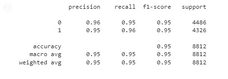

# Reporte del Modelo Baseline

Este documento contiene los resultados del modelo baseline.

## Descripción del modelo

Para la implementación del modelo baseline se realizan pruebas con los modelos: XGBClassifier y RandomForestClassiffier. De acuerdo con los resultados obtenidos la implementación con RandomForestClassiffier es el seleccionado como baseline.

## Variables de entrada

Las variables de entrada del modelo son:

title : título de  la noticia

text : contenido de la noticia

Estas dos variables se procesaron para unirlas en una sola columna, generar una lista y  posteriormente convertir estos textos en una matriz de características TF-IDF. Representación que es requerida para el modelo baseline.

## Variable objetivo

La variable objetivo utilizada en el modelo es:

type : tipo de la noticia. 0 - Falsa, 1 - verdadera.

## Evaluación del modelo

### Métricas de evaluación

Las métricas usadas en el modelo son accuracy y F1-score.

### Resultados de evaluación

Los resultados para la implementación con XGBClassifier no han mostrado hasta el momento resultados coherentes. Al continuar con la revisión y generación de la línea base adecuada se realizan pruebas con RandomForestClassiffier.

Con esta última implementación se obtienen resultados importantes como se muestra en la siguiente gráfica:

 

## Análisis de los resultados

En cuanto al modelo baseline seleccionado se destacan varios elementos importantes:

1. Es un modelo con un bajo grado de dificultad para implementar.
2. No requiere altos recursos computacionales para ser usado, incluso con los recursos gratuitos de Google Colab es posible ejecutarlo.
3. Los resultados obtenidos en la métricas objetivo 

## Conclusiones

Los resultados obtenidos con la implementación con el modelo XGBClassifier hasta el momento no corresponden con lo esperado, pues después de varios intentos y modificaciones en la definición del modelo se sigue presentando una exactitud de 1. Lo cual en este tipo de problemas refleja posibles errores que deben ser revisados.

De acuerdo con estos resultados se realizan pruebas con otra implementación usando RandomForestClassiffier logrando mejores resultados como se puede observar en las métricas presentadas.

Es importante mencionar que dado el alcance del presente proyecto no se llevaron a cabo otras actividades que permitieran analizar los textos de entrada con mayor profundidad por ejemplo con la herramienta pyLDAvis. Y tampoco se incluyeron otros técnicas para el afinamiento del modelo como Grid search de manera que ayudara explorando el espacio de posibles soluciones al problema planteado. Continuar iterando en el ajuste del modelo con técnicas existentes hace parte del ciclo de la metodología utilizada y cuyo objetivo es lograr el mejor resultado para el problema planteado.

## Referencias

[XGBoost Documentation](https://xgboost.readthedocs.io/en/stable/index.html)

[RandomForestClassifier Documentation](https://scikit-learn.org/stable/modules/generated/sklearn.ensemble.RandomForestClassifier.html)