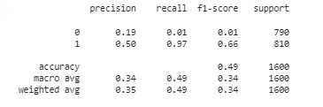

# Reporte del Modelo Final

## Resumen Ejecutivo

El modelo final se basa en el uso del modelo de clasificación de deep learning y se ha implementado con el uso del modelo pre-entrenado BERT.

En cuanto a las métricas obtenidas:

Se puede observar que aunque el accuracy es de 0.49, las otras métricas: f1-score, Precision y Recall son muy bajas para la clase 0 (noticias falsas) y presenta mejores resultados para la clase 1 (noticias reales).

Con estos resultados el modelo requiere mejoras importantes que superen las limitaciones descritas en este documento y especialmente en la consecusión de mejores recursos de cómputo que permitan procesar el conjunto de datos completo y con otros niveles de exigencia (número de epochs, tamaño del batch) para obtener mejores resultados.

## Descripción del Problema

En distintos contextos de la comunicación de noticias y en especial en redes sociales es cada vez más común la mezcla de noticias reales y falsas y la dificultad para los lectores y consumidores de estas noticias de identificar que es real y que es falso. Las plataformas y en general algunas asociaciones de comunicadores se han preocupado por desarrollar mecanismos que les permitan la identificación de noticias falsas y que estos mecanimos se soporten en tecnología escalable y que ler permitan procesar grandes volúmenes de información.

Es por esto que la inteligencia artificial y especialmente el Machine Learning alcanza un papel fundamental para proveer estos mecanismos que a través del entrenamiento puedan procesar grandes volúmenes de información, identificar las noticias falsas y que sean escalables de manera que su entrenamiento y actualización sea continúo en el tiempo para que no pierdan su efectividad en esta tarea de clasificación.

Particularmente en este proyecto se ha planteado desarrollar un mecanismo de identificación de noticias falsas con el uso de tecnologías de Machine Learning que apoye al área de análisis de medios en la iniciativa de control de noticias. 
    
Considerando el objetivo del proyecto se espera:
  1. Contar con un modelo de machine learning que permita identificar noticias falsas, dado un conjunto de noticias.
  2. El modelo implementado debe entregar el nivel de confianza de la predicción de manera que basado en un umbral acordado se establezcan las acciones a tomar.

El modelo final seleccionado se describe en este documento y tiene como propósito responder a los objetivos del proyecto.

## Descripción del Modelo

Como se ha mencionado en las secciones anteriores el modelo de clasificación implementado se basa en el uso del modelo pre-entrenado. La técnica de entrenamiento seleccionada pfue Transfer Learning.

Descripción del modelo:

* Se congelan las capas del modelo BERT.
* Se compila el modelo definiendo Adam como optimizador y al tener dos neuronas de salida se usa la función de pérdida: CategoricalCrossentropy. Además se usa una tasa de aprendizaje de 5e-6.
* Se define un stopping en callback, monitoreando la métrica "accuracy" en validación, definiendo un valor en patience dependiendo del número de epochs y buscando maximizar el valor de accuracy en validación.
* Se define un checkpoint en callback, monitoreando la métrica "accuracy" en validación y buscando maximizar el valor de accuracy en validación. Adicionalmente guardando los pesos del modelo con los mejores resultados.
* El parámetro validation_split (definición de la porción de datos usada para validación) es 0.2.
* Número de epochs = 5.
* Tamaño del batch = 1000.

Teniendo en cuenta los recursos computacionales para la implementación del presente modelo se tomaron las siguientes decisiones para lograr una versión entrenada del modelo y con resultados que pemitan ofrecer un mecanismo de clasificación de noticias reales y falsas:

* El entrenamiento no pudo hacerse con las variables title y text dado que la memoria del equipo de cómputo usado no era suficiente para la ejecución de las distintas funciones. Por ello se decidió solo usar la variable title.
* Adicionalmente y por las mismas razones de la infraestructura disponible se tomó una muestra de los datasets, 4000 registros de noticias falsas y 4000 registros de noticias reales.
* El número de epochs y el tamaño del batch también se selecionaron para lograr viabilidad en el entrenamiento del modelo.

## Evaluación del Modelo

En la siguiente gráfica se presenta los métricas obtenidas en la evaluación de este modelo:

* Se puede observar un accuracy de 0.49.
* Las otras métricas: f1-score, Precision y Recall son muy bajas para la clase 0 (noticias falsas) y presenta mejores resultados para la clase 1 (noticias reales).
* Con los resultados que se evidencian en las métricas de evaluación del modelo, se concluye que este modelo requiere mejoras y continuar en el proceso de entrenamiento, evaluación y mejoramiento.
* Con estos resultados y poder lograr mejores resultados con el modelo se requiere superar las limitaciones descritas en este documento y especialmente en la consecusión de mejores recursos de cómputo que permitan procesar el conjunto de datos completo y con otros niveles de exigencia (número de epochs, tamaño del batch) para obtener los resultados esperados.

## Conclusiones y Recomendaciones

Como resultado de la implementación del Modelo Final descrito en este documento y las distintas actividades que involucra emprender un proyecto de este alcance se establecen las siguientes conclusiones:

1. Teniendo en cuenta las limitaciones en los recursos de cómputo disponibles en este proyecto y que se presentan en distintos proyectos, es importante considerar técnicas que permitan reducir la complejidad de los datos y que a su vez mantengan la información relevante. Por eso he considerado para una segunda fase de este proyecto usar técnicas de sumarización de texto con el propósito de reducir el tamaño del contenido de las noticias y poder usar este contenido (variable text) en el entrenamiento del modelo final seleccionado.
2. Aunque la implementación del modelo final seleccionado no se logró entrenar con la totalidad de los datos del dataset, se confirma ésta implementación como el modelo en esta fase del proyecto esperando probar esta implementación con mejores resultados computacionales y así lograr una comparación efectiva con el modelo Baseline elegido.
3. La infraestructura es una variable importante en el desarrollo de proyectos de Machine Learning por eso es importante que desde un inicio  los distintos equipos de un proyecto: científicos de datos, ingenieros de machine learning, arquitectos y demás roles relevantes se encuentren presentes para llevar cabo las discusiones y la toma de decisiones para establecer la arquitectura, los recursos disponibles y las capacidades requeridas para lograr con éxito los resultados esperados.
4. Aunque los resultados obtenidos en este modelo final pueden mejorarse dadas las limitaciones descritas. Todo este desarrollo de validar otros modelos hace parte de los proyectos de machine learning para lograr desarrollar conocimiento de otras implementaciones, entender su funcionamiento y ganar esa experiencia que se potencialice para futuros proyectos. 
5. En cuanto a la comparación de los resultados del modelo baseline y modelo final, las métricas nos muestran que el modelo baseline es mejor y cuenta con un nivel de confianza superior. 
6. Dados los resultados obtenidos con el modelo baseline y el modelo final y teniendo en cuenta las limitaciones para obtener una mejor versión del modelo final, se selecciona el modelo baseline como el artefacto a desplegar en la siguiente fase del proyecto.

## Referencias

[Bert Model Documentation](https://huggingface.co/docs/transformers/model_doc/bert)

